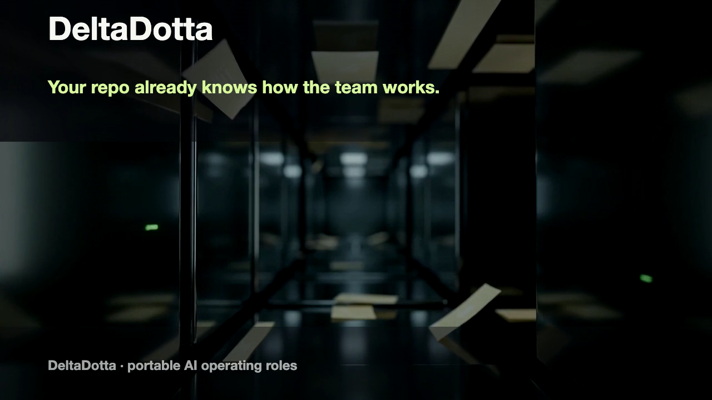
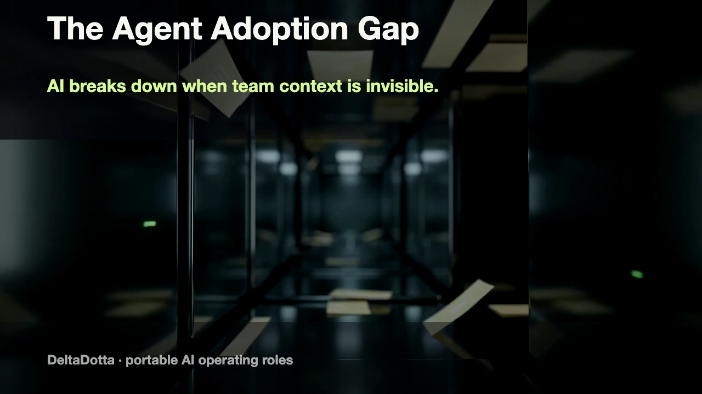
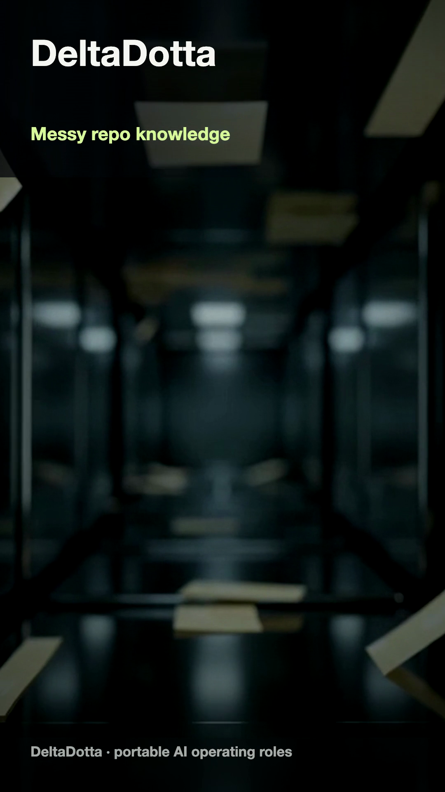

<p align="center">
  <a href="https://github.com/abdullahbilalawan/deltadotta">
    
  </a>
</p>

<h1 align="center">DeltaDotta</h1>

<p align="center">
  <strong>Turn messy team knowledge into portable AI operating roles.</strong><br />
  DeltaDotta scans local repo evidence, maps owners and escalation paths, and exports preflighted role skills for Codex or Claude Code.<br />
  One guided command gives your AI agents the context, boundaries, and handoffs they need before touching real work.
</p>

<p align="center">
  <a href="LICENSE">Apache-2.0</a> · <a href="CONTRIBUTING.md">Contributing</a> · <a href="SECURITY.md">Security</a> · <a href="TRADEMARK.md">Trademark guidelines</a>
</p>

<p align="center">
  <a href="#quick-start">Get started</a> · <a href="#demo-gallery">Demos</a> · <a href="#deploy-with-docker">Deploy</a> · <a href="#contributing">Collaborate</a>
</p>

<p align="center">
  
</p>

<p align="center">
  <a href="#marketing-campaign-film">Campaign previews</a> ·
  <a href="#higgsfield-campaign-cutdowns">Higgsfield cutdowns</a> ·
  <a href="#human-speed-onboarding">Onboarding walkthrough</a> ·
  <a href="docs/demos/northstar-deltadotta-package.zip">Download sample package</a> ·
  <a href="docs/demos/CLAUDE-DEMO-STORYBOARD.md">Claude import storyboard</a>
</p>

## What is DeltaDotta?

DeltaDotta is a local-first organization compiler for teams adopting AI agents.
It turns local operating evidence into a readable hierarchy, portable role
skills, authority boundaries, handoffs, and escalation rules.

The default experience is a guided CLI wizard. It asks one plain-language
question at a time, produces a usable team map in under ten minutes, and sets up
one safe first-shift role for Codex or Claude Code. No command-line options are
needed for normal use.

### Included team templates

| Template | Team map | First preflighted role |
| --- | --- | --- |
| Software | Engineering Lead, DevOps / Platform, Software Engineer, Product Designer, QA Engineer | DevOps / Platform Engineer |
| Manufacturing | Manufacturing Director, Production Operations, Process Engineering, Quality, Maintenance | Production Operations Lead |

Both templates begin with visible assumptions, preserve evidence provenance, and
keep preflight checks read-only.

### What you get

| Output | Why it matters |
| --- | --- |
| Hierarchy map | Shows who owns decisions, where handoffs go, and when escalation is required. |
| Role skills | Gives Codex or Claude Code focused operating instructions backed by source evidence. |
| Provider context | Installs a marked `AGENTS.md` or `CLAUDE.md` block without taking over the repo. |
| Preflight report | Records what was scanned, what was generated, and which first-shift role passed package checks. |
| Confidence report | Lists source fingerprints, template assumptions, open gaps, and provider-side enforcement limits. |
| Portable ZIP | Lets teams review, share, import, or archive the generated operating package. |

## Quick start

### Prerequisites

- Node.js 20 or later
- pnpm (Corepack is included with supported Node releases)
- Optional: an authenticated Codex or Claude Code installation for first-shift
  provider preflight

### Setup in three steps

1. Run the guided Launchpad:

```bash
npx deltadotta
```

2. Answer five plain-language questions:

```text
Team type -> owner -> authority -> escalation -> handoff
```

3. Open the generated package:

```text
<workspace>/.deltadotta/launchpad/
```

The wizard scans local evidence, creates the map, installs provider context when
you approve it, and preflights the first role in a read-only first shift.

From a local checkout:

```bash
corepack enable
pnpm install --frozen-lockfile
pnpm cli:build
node dist/bin/deltadotta.js
```

That folder contains the hierarchy map, portable package, role contracts,
provider context, and a first-shift report. DeltaDotta only changes its clearly
marked block in `AGENTS.md` or `CLAUDE.md`. Choose the no-install option in the
wizard if you only want the portable package.

### Try the included demo workspace

Use the Northstar Checkout demo to see the full flow without using private team
files:

```bash
node dist/bin/deltadotta.js
```

When prompted for the workspace, choose:

```text
docs/demo-workspace
```

The demo workspace includes product knowledge, a runbook, CODEOWNERS, and an
installed provider context so you can inspect the source evidence and generated
Launchpad output side by side.

## Demo gallery

These demos are built from local sample workspaces and generated DeltaDotta
packages. They are safe to inspect, share, and use as a starting point for your
own product walkthrough.

### Marketing campaign film

A set of Higgsfield-backed launch films for introducing DeltaDotta in a README,
launch post, or demo opener. They use Higgsfield-generated cinematic footage
with controlled DeltaDotta overlays so the product name, role names, and CTA
stay correct.


Full-resolution MP4 renders and animated GIFs are intentionally kept out of Git.
Use the poster frames below in the README, and regenerate local video files with
the demo build scripts when you need export-ready assets.

### Higgsfield campaign cutdowns

Three Higgsfield-backed marketing poster frames are included for different
launch surfaces. Each comes from Higgsfield-generated cinematic footage with controlled
DeltaDotta overlays so the product name, role names, and CTA stay correct.

- Premium campaign poster: [deltadotta-higgsfield-premium-campaign-poster.png](docs/demos/deltadotta-higgsfield-premium-campaign-poster.png)
- Founder cut poster: [deltadotta-higgsfield-founder-cut-poster.png](docs/demos/deltadotta-higgsfield-founder-cut-poster.png)
- Vertical social reel poster: [deltadotta-higgsfield-social-reel-poster.png](docs/demos/deltadotta-higgsfield-social-reel-poster.png)






### Guided Launchpad flows

Fast-forwarded captures of the real CLI running against fresh local test
repositories. Each records the evidence scan, five confirmations, provider
context installation, and final preflight result.

#### Software Launchpad

Use the packaged demo workspace and storyboard to replay the Software Launchpad
flow locally.

#### Manufacturing Launchpad

Use the packaged demo workspace and storyboard to replay the Manufacturing
Launchpad flow locally.

### Human-speed onboarding

A slower, presenter-friendly recording that creates repo evidence, runs the
Software Launchpad, installs provider context, and ends on a preflighted package.

Export-ready MP4 walkthroughs and animated previews are generated locally and
ignored by Git.

### Product story cards

These cards are useful in READMEs, launch posts, investor updates, and demo
decks when you need to explain what the generated package contains.

#### Verified role package


Source: [package-card.svg](docs/demos/package-card.svg)

#### Operating map


Source: [hierarchy-card.svg](docs/demos/hierarchy-card.svg)

### Claude skill import demo

The Claude storyboard shows how to import the generated focused role skill and
prove the value with a failed-deployment prompt.

- Storyboard: [CLAUDE-DEMO-STORYBOARD.md](docs/demos/CLAUDE-DEMO-STORYBOARD.md)
- Focused Claude skill ZIP: [northstar-devops-platform-engineer-claude-skill.zip](docs/demos/northstar-devops-platform-engineer-claude-skill.zip)
- Full sample DeltaDotta package: [northstar-deltadotta-package.zip](docs/demos/northstar-deltadotta-package.zip)

### Demo workspace

The Northstar Checkout demo workspace contains the source evidence used by the
Claude and package demos:

- [README.md](docs/demo-workspace/README.md)
- [PRODUCT-KNOWLEDGE.md](docs/demo-workspace/PRODUCT-KNOWLEDGE.md)
- [RUNBOOK.md](docs/demo-workspace/RUNBOOK.md)
- [AGENTS.md](docs/demo-workspace/AGENTS.md)
- [CODEOWNERS](docs/demo-workspace/CODEOWNERS)

Generated launchpad output is included under
[`docs/demo-workspace/.deltadotta/launchpad/`](docs/demo-workspace/.deltadotta/launchpad/).

### Preview assets

Use these lightweight poster frames and cards in READMEs, launch posts, and
demo decks:

- [deltadotta-long-higgsfield-campaign-poster.png](docs/demos/deltadotta-long-higgsfield-campaign-poster.png)
- [deltadotta-higgsfield-premium-campaign-poster.png](docs/demos/deltadotta-higgsfield-premium-campaign-poster.png)
- [deltadotta-higgsfield-founder-cut-poster.png](docs/demos/deltadotta-higgsfield-founder-cut-poster.png)
- [deltadotta-higgsfield-social-reel-poster.png](docs/demos/deltadotta-higgsfield-social-reel-poster.png)
- [deltadotta-higgsfield-marketing-film-poster.png](docs/demos/deltadotta-higgsfield-marketing-film-poster.png)
- [deltadotta-marketing-film-poster.png](docs/demos/deltadotta-marketing-film-poster.png)
- [package-card.png](docs/demos/package-card.png)
- [hierarchy-card.png](docs/demos/hierarchy-card.png)

### Source assets

The demo source files are included for remixing or re-recording:

- Terminal recording script: [human-onboarding.tape](docs/demos/human-onboarding.tape)
- Software and Manufacturing frame stills: [docs/demos/frames/](docs/demos/frames/)

### Use the web workspace

```bash
pnpm dev
```

Open [http://localhost:3000](http://localhost:3000). The workspace provides
Software and Manufacturing templates, evidence review, role editing, package
import, and ZIP export. The CLI remains the recommended path for repository
scanning and provider setup.

## Deploy with Docker

The web workspace is self-contained today; it does not require a database to
run. Build and start the production image with:

```bash
docker compose up --build
```

Open [http://localhost:3000](http://localhost:3000). Container health is exposed
at `/api/health`. Set `PORT` before starting Compose if port 3000 is unavailable.

For a platform that accepts a Dockerfile, deploy the included image directly. It
runs as a non-root user and uses Next.js standalone output.

## Portable package contract

Every export includes a stable machine-readable graph and human-readable role
context:

```text
deltadotta-package/
  manifest.yaml
  graph.json
  ORGANIZATION.md
  GAPS.md
  roles/<role>/SKILL.md
  contracts/<primary-role>.md
  policies/
  PROVIDER-IMPORT.md
```

`manifest.yaml` and `graph.json` are the public compatibility contract.
Markdown files are designed to be readable by people and model providers.
DeltaDotta describes authority and escalation; it does not enforce permissions
inside third-party providers.

`GAPS.md` is the honesty layer: it records source fingerprints, template
assumptions, lint issues, and the provider-side controls still required before a
role receives real tool access.

## Useful commands

```bash
pnpm verify                 # typecheck, CLI build, tests, and production build
pnpm dev                    # web workspace
pnpm cli                    # guided CLI from this checkout
deltadotta check            # detect repository evidence that moved or disappeared
deltadotta init             # deeper open-ended organization interview
```

`deltadotta launch` supports advanced options for automation only. The normal
workflow is simply `deltadotta`.

## Safety and privacy

- Repository scanning is local and bounded.
- Generated evidence is visible in the package.
- First-shift preflight is read-only: it must not deploy, restart equipment,
  modify infrastructure, access production credentials, or change records.
- Do not commit real organization exports, credentials, or provider tokens.

Read [SECURITY.md](SECURITY.md) before reporting a vulnerability.

## Contributing

Contributions are welcome. Start with [CONTRIBUTING.md](CONTRIBUTING.md), follow
the [Code of Conduct](CODE_OF_CONDUCT.md), and use the templates in `.github/`.
The maintainer decision process is in [GOVERNANCE.md](GOVERNANCE.md).

## License and trademarks

DeltaDotta source code is licensed under [Apache-2.0](LICENSE). The DeltaDotta
name and visual identity are governed separately by [TRADEMARK.md](TRADEMARK.md).
