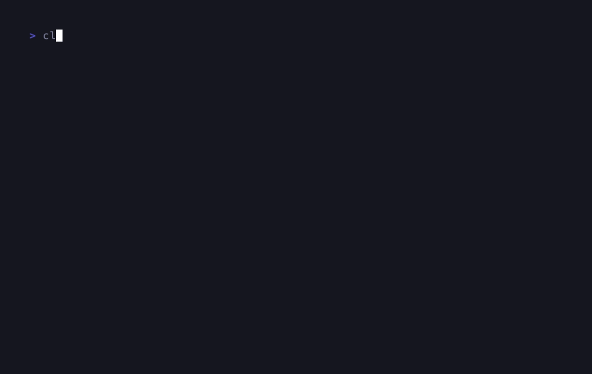
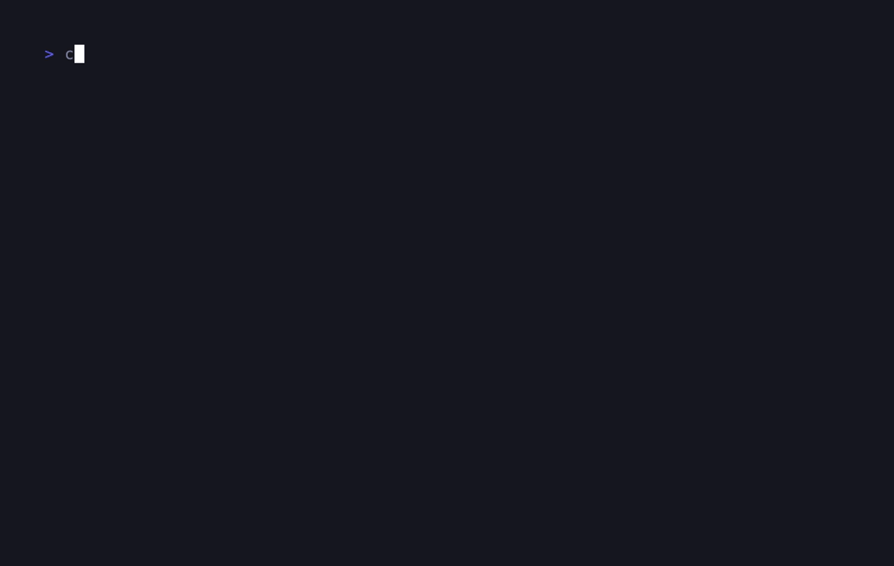
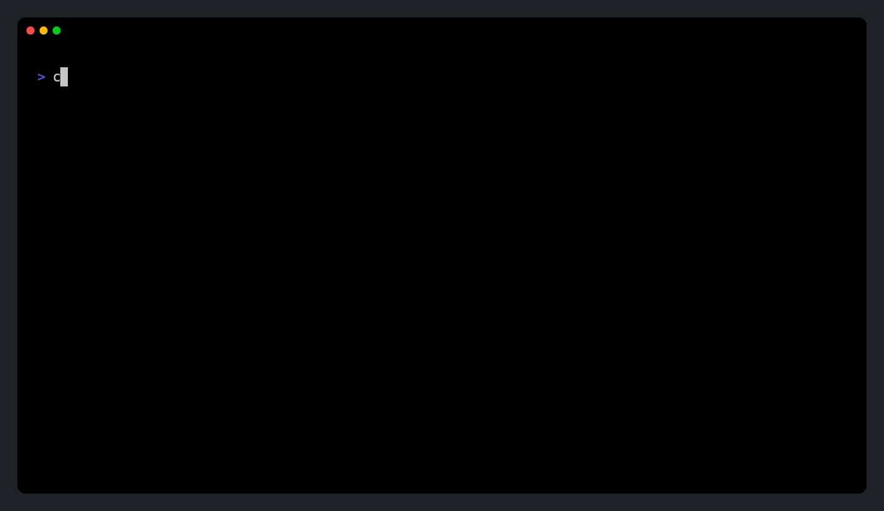
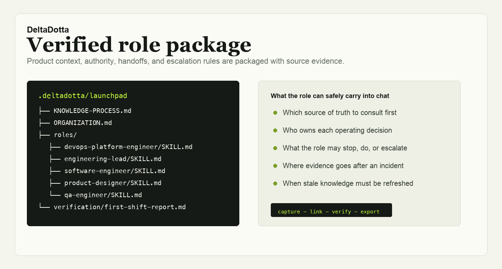
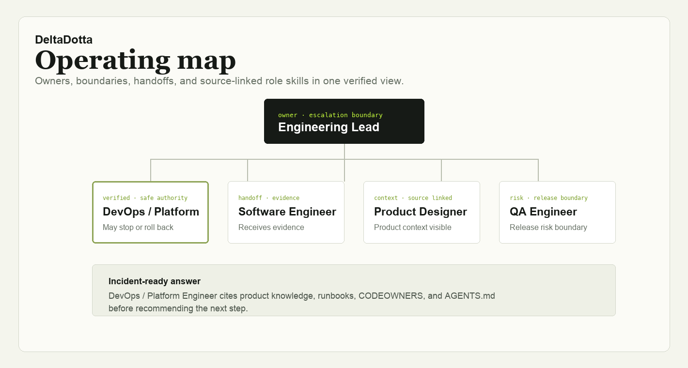

<p align="center">
  <a href="https://github.com/abdullahbilalawan/deltadotta">
    
  </a>
</p>

<h1 align="center">DeltaDotta</h1>

<p align="center">
  <strong>Build a portable, evidence-backed team operating system in minutes.</strong>
</p>

<p align="center">
  <a href="LICENSE">Apache-2.0</a> · <a href="CONTRIBUTING.md">Contributing</a> · <a href="SECURITY.md">Security</a> · <a href="TRADEMARK.md">Trademark guidelines</a>
</p>

<p align="center">
  <a href="#quick-start">Get started</a> · <a href="#demo-gallery">Demos</a> · <a href="#deploy-with-docker">Deploy</a> · <a href="#contributing">Collaborate</a>
</p>

## What is DeltaDotta?

DeltaDotta is a local-first organization compiler for teams adopting AI agents.
It turns local operating evidence into a readable hierarchy, portable role
skills, authority boundaries, handoffs, and escalation rules.

The default experience is a guided CLI wizard. It asks one plain-language
question at a time, produces a usable team map in under ten minutes, and sets up
one safe first-shift role for Codex or Claude Code. No command-line options are
needed for normal use.

### Included team templates

| Template | Team map | First verified role |
| --- | --- | --- |
| Software | Engineering Lead, DevOps / Platform, Software Engineer, Product Designer, QA Engineer | DevOps / Platform Engineer |
| Manufacturing | Manufacturing Director, Production Operations, Process Engineering, Quality, Maintenance | Production Operations Lead |

Both templates begin with visible assumptions, preserve evidence provenance, and
keep verification read-only.

## Quick start

### Prerequisites

- Node.js 20 or later
- pnpm (Corepack is included with supported Node releases)
- Optional: an authenticated Codex or Claude Code installation for first-shift
  provider verification

### Run the guided Launchpad

```bash
npx deltadotta
```

Or from a checkout:

```bash
corepack enable
pnpm install --frozen-lockfile
pnpm cli:build
node dist/bin/deltadotta.js
```

The wizard will ask for a workspace folder, let you choose Software or
Manufacturing from a numbered menu, scan local evidence, and ask five short
operating questions. It writes the result to:

```text
<workspace>/.deltadotta/launchpad/
```

That folder contains the hierarchy map, portable package, role contracts,
provider context, and a first-shift report. DeltaDotta only changes its clearly
marked block in `AGENTS.md` or `CLAUDE.md`. Choose the no-install option in the
wizard if you only want the portable package.

## Demo gallery

These demos are built from local sample workspaces and generated DeltaDotta
packages. They are safe to inspect, share, and use as a starting point for your
own product walkthrough.

### Guided Launchpad flows

Fast-forwarded captures of the real CLI running against fresh local test
repositories. Each records the evidence scan, five confirmations, provider
context installation, and final verification result.

#### Software Launchpad



#### Manufacturing Launchpad



### Human-speed onboarding

A slower, presenter-friendly recording that creates repo evidence, runs the
Software Launchpad, installs provider context, and ends on a verified package.



Video version: [deltadotta-human-onboarding.mp4](docs/demos/deltadotta-human-onboarding.mp4)

### Product story cards

These cards are useful in READMEs, launch posts, investor updates, and demo
decks when you need to explain what the generated package contains.

#### Verified role package



Source: [package-card.svg](docs/demos/package-card.svg)

#### Operating map



Source: [hierarchy-card.svg](docs/demos/hierarchy-card.svg)

### Claude skill import demo

The Claude storyboard shows how to import the generated focused role skill and
prove the value with a failed-deployment prompt.

- Storyboard: [CLAUDE-DEMO-STORYBOARD.md](docs/demos/CLAUDE-DEMO-STORYBOARD.md)
- Focused Claude skill ZIP: [northstar-devops-platform-engineer-claude-skill.zip](docs/demos/northstar-devops-platform-engineer-claude-skill.zip)
- Full sample DeltaDotta package: [northstar-deltadotta-package.zip](docs/demos/northstar-deltadotta-package.zip)

### Demo workspace

The Northstar Checkout demo workspace contains the source evidence used by the
Claude and package demos:

- [README.md](docs/demo-workspace/README.md)
- [PRODUCT-KNOWLEDGE.md](docs/demo-workspace/PRODUCT-KNOWLEDGE.md)
- [RUNBOOK.md](docs/demo-workspace/RUNBOOK.md)
- [AGENTS.md](docs/demo-workspace/AGENTS.md)
- [CODEOWNERS](docs/demo-workspace/CODEOWNERS)

Generated launchpad output is included under
[`docs/demo-workspace/.deltadotta/launchpad/`](docs/demo-workspace/.deltadotta/launchpad/).

### Loop assets

Use these when you need a shorter animated loop instead of the full human-speed
walkthrough:

- [deltadotta-onboarding-loop.gif](docs/demos/deltadotta-onboarding-loop.gif)
- [deltadotta-onboarding-loop.mp4](docs/demos/deltadotta-onboarding-loop.mp4)

### Source assets

The demo source files are included for remixing or re-recording:

- Terminal recording script: [human-onboarding.tape](docs/demos/human-onboarding.tape)
- Software and Manufacturing frame stills: [docs/demos/frames/](docs/demos/frames/)

### Use the web workspace

```bash
pnpm dev
```

Open [http://localhost:3000](http://localhost:3000). The workspace provides
Software and Manufacturing templates, evidence review, role editing, package
import, and ZIP export. The CLI remains the recommended path for repository
scanning and provider setup.

## Deploy with Docker

The web workspace is self-contained today; it does not require a database to
run. Build and start the production image with:

```bash
docker compose up --build
```

Open [http://localhost:3000](http://localhost:3000). Container health is exposed
at `/api/health`. Set `PORT` before starting Compose if port 3000 is unavailable.

For a platform that accepts a Dockerfile, deploy the included image directly. It
runs as a non-root user and uses Next.js standalone output.

## Portable package contract

Every export includes a stable machine-readable graph and human-readable role
context:

```text
deltadotta-package/
  manifest.yaml
  graph.json
  ORGANIZATION.md
  roles/<role>/SKILL.md
  contracts/<primary-role>.md
  policies/
  PROVIDER-IMPORT.md
```

`manifest.yaml` and `graph.json` are the public compatibility contract.
Markdown files are designed to be readable by people and model providers.
DeltaDotta describes authority and escalation; it does not enforce permissions
inside third-party providers.

## Useful commands

```bash
pnpm verify                 # typecheck, CLI build, tests, and production build
pnpm dev                    # web workspace
pnpm cli                    # guided CLI from this checkout
deltadotta check            # detect repository evidence that moved or disappeared
deltadotta init             # deeper open-ended organization interview
```

`deltadotta launch` supports advanced options for automation only. The normal
workflow is simply `deltadotta`.

## Safety and privacy

- Repository scanning is local and bounded.
- Generated evidence is visible in the package.
- First-shift verification is read-only: it must not deploy, restart equipment,
  modify infrastructure, access production credentials, or change records.
- Do not commit real organization exports, credentials, or provider tokens.

Read [SECURITY.md](SECURITY.md) before reporting a vulnerability.

## Contributing

Contributions are welcome. Start with [CONTRIBUTING.md](CONTRIBUTING.md), follow
the [Code of Conduct](CODE_OF_CONDUCT.md), and use the templates in `.github/`.
The maintainer decision process is in [GOVERNANCE.md](GOVERNANCE.md).

## License and trademarks

DeltaDotta source code is licensed under [Apache-2.0](LICENSE). The DeltaDotta
name and visual identity are governed separately by [TRADEMARK.md](TRADEMARK.md).
